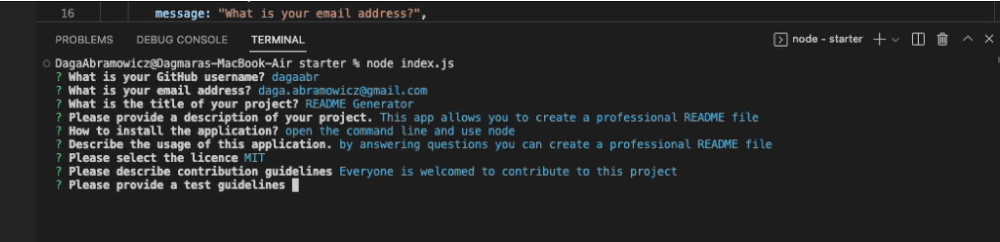

# README Generator

  ## Table of Contents
  * [Description](#description)
  * [Installation](#installation)
  * [Usage](#usage)
  * [Contributing](#contributing)
  * [Tests](#test)
  * [Questions](#questions)
  * [Licence](#licence)

  ## Description
  This app allows you to create a professional README file by using just a command line

  ## Installation
  Open the terminal and use node in the command line

  ## Usage
  By answering questions you can create a professional README file
  

  ## Contributing
  Everyone is welcomed to contribute to this project

  ## Tests
  To run tests, run the following command - npm test

  ## Questions
  If you have any questions regarding this repo, contact me via GitHub: dagaabr, or via email: daga.abramowicz@gmail.com

  ## Licence
  This product is licenced under the MIT licence
